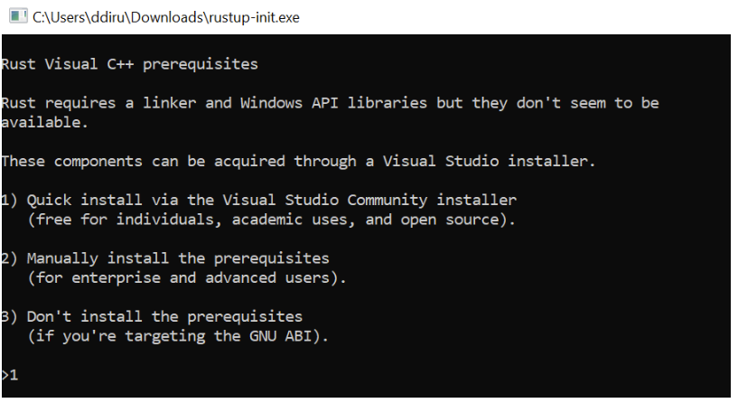
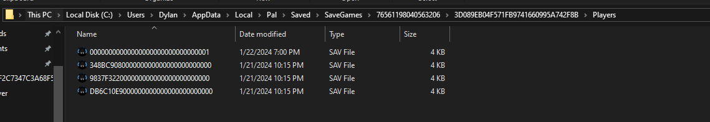
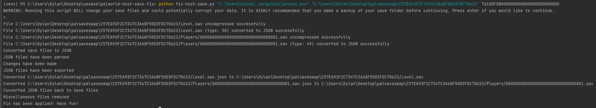

## All you need to know to transfer your co-op host file to a Palworld Dedicated Server

If you’re like me, you may have the distinct privilege of being the resident IT guy in your group of friends or simply the person with the best internet connection that created the initial co-op game. With that privilege comes the opportunity to run a dedicated server for games such as Palworld. 

Unfortunately, you may have learned that while you can quite simply transfer the Save game files to your dedicated server, your Palworld character that you spent hours on in that initial co-op session with your friends will not work correctly. This guide will be an in-depth walk through of how to accomplish transferring your co-op player save file so you are once again able to adventure with your same character on a dedicated server.

Today we will be using xNul's Palworld Host Save Fix to convert your local .sav file to one that can be used in a dedicated server so you may preserve any progress already made in a co-op game as a host.



<h3> Prerequisites: </h3>

- Palworld Dedicated Server is installed, running, and you're able to join it.

- Python 3

- [Uesave-rs](https://github.com/trumank/uesave-rs)


**Important!**


1. Ensure your Palworld saves are backed up before going any further. Create a local backup of the folder at “C:\Users\User\AppData\Local\Pal\Saved\SaveGames\76561198047383206”. 

2. If your character is in a Guild make sure you login to your saved game and either leave the guild or transfer the Guild master role to another guild member. This is very important as there is a bug using this method in which that guild membership doesn't work properly on the co-op host's character.

<h3> Instructions to install Prerequisites: </h3>

If you have completed both of the above we are now ready to proceed with installing the prerequisites required for the Palworld Host Save Fix script.

1. We will first need to install the [Uesave-rs](https://github.com/trumank/uesave-rs) application, to do this we must first install rust. Navigate to [this   ](https://doc.rust-lang.org/cargo/getting-started/installation.html) website and download the [rustup-init.exe](https://win.rustup.rs/)
2. Press 1 to “Quick Install via the Visual Studio Community Installer”. Press 1 once again to complete the installation of Rust.

<div style="flex: 1; margin: 10px; min-width: 64px;">
    
</div>


3. Once Rust is installed we can now install Uesave-rs which is necessary for the fix to work. Open up the command prompt and enter the following “cargo install --git https://github.com/trumank/uesave-rs.git”. This will install Uesave and will place the necessary executable file in your local path i.e: "C:\Users\ddiru\\.cargo\bin\uesave.exe"
4. Now we are ready to download the necessary project files from the “Palworld Host Save Fix” GitHub repository. Create a new folder on your Desktop and then navigate in your terminal to that directory. Enter a “git clone https://github.com/xNul/palworld-host-save-fix.git” command to download the project files. If you don’t have git installed simply download the zip file from GitHub and extract the files.
5. Now all Prerequisites should be installed and you can proceed to applying the fix.

<h3> Instructions for running the Palworld Host Save Fix script: </h3>


1. Copy the save folder you want from C:\Users<username>\AppData\Local\Pal\Saved\SaveGames<random_numbers> to your dedicated server. This is your local saved folder and can also be found by going in-game and clicking the small folder icon in the bottom right when you load a game.



2. In the PalServer\Pal\Saved\Config\WindowsServer\GameUserSettings.ini file, change DedicatedServerName to match your save's folder name. For example, if the folder name is 2E85FD38BAA792EB1D4C09386F3A3CDA, update DedicatedServerName=2E85FD38BAA792EB1D4C09386F3A3CDA.
3. Turn off your dedicated server and then delete PalServer\Pal\Saved\SaveGames\0<your_save_here>\WorldOption.sav to allow modification of PalWorldSettings.ini. Players will need to choose their respawn point again, but nothing else is affected.
4. Turn back on your dedicated server. Confirm connection to your save on the dedicated server. Check the world using a character that doesn't belong to the co-op host. All buildings and world should be the same as it was in the co-op game. 
5. You will now need to create a new character on your dedicated server. Don’t worry this is just creating the .sav file that will be used to transfer your old save onto. A new .sav file appears in PalServer\Pal\Saved\SaveGames\0<your_save_here>\Players. This file is the host's GUID.
6. Copy the entire dedicated server save at PalServer\Pal\Saved\SaveGames\0<your_save_here> (the save with the co-op host's new character!) to the desktop folder we created earlier. 
7. You will notice that the GUID in the .sav file from the dedicated server has a different GUID from the other .save files in your local co-op saved files (these are the other players that connected to your session during the co-op game). This GUID is what will need when we run the script. 
8. At this point we should have a folder copied from our dedicated server with both our host .sav file (00000000000000000000000000000001.sav) and new dedicated server .save file (C57EA93F2C0000000000000000000000.sav).
9. Open your terminal and navigate to the desktop folder where your save folder is stored. Using your newly learned GUID from the .save file construct the string you will use for the fix-host-save script

```bash
python fix-host-save.py "C:\Users\John\.cargo\bin\uesave.exe" "C:\Users\John\Desktop\my_temporary_folder\2E85FD38BAA792EB1D4C09386F3A3CDA" 6E80B1A6000000000000000000000000
```
10. After you have done this, you will be informed that you should make a backup. Press enter once more and the process will take about 1-2 minutes. If completed successfully you will see some traceback saying that the the script completed successfully:
  


11. Now copy ALL data from your local folder back to your dedicated server path: “palworld\Pal\Saved\SaveGames\0”. If you don’t copy all data, you will get the wheel of death when loading back into your server. Now turn your server back on and your character should load back into Palworld.

